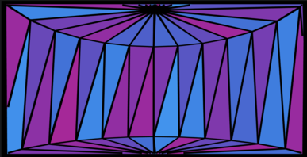

# My Homepage xD

Bella Perez

## What is this?
Hello! Welcome to my humble homepage. This right here is a collection of work experimenting with javascript using p5 library for CART 253. With thoughtful consideration, I hope to make something crunchy and perhaps cute, mixed with a sense of eeriness. 

### Where you can find me!
I like playing and making games! Specifically, I like story-driven games or those with fantastical elements. Some of my favourite games include Sky Cotl, BG3, and Little Goody Two Shoes. 

- [Itch.io](https://hheavenly.itch.io/)
- [GitHub](https://github.com/NanaO707)

## Prototypes Below!!

### A house is a home - Instructions 

- [Prototype-Instructions-Representational](Prototypes/Instructions/Representational%20Prototype/index.html)

### Stained Glass Illusion - Instructions   

- [Prototype-Intructions-Abstract](Prototypes/Instructions/Abstract%20Prototype/index.html)

### Colony of Eyeballs - Instructions   

- [Prototype-Instructions-Really Weird](Prototypes/Instructions/Really%20Weird%20Prototype/index.html)

### N/A

- [Prototype-Varaibles](Prototypes/Variables/index.html)

## Journal Below!!

[Reflective Journal](Journal.md)

## Challenges Below!!

- [Challenges-Variables ](Challenges/Variables_BellaPerez/index.html) 
- [Challenges-Conditionals](Challenges/Conditionals_BellaPerez/index.html)
- [Challenges-Events](Challenges/Events_BellaPerez/index.html)

## Attribution

- This project uses [p5.js](https://p5js.org).
- The banner image is from @_rexpo on X (twitter) 

## License

> This project is licensed under a Creative Commons Attribution ([CC BY 4.0](https://creativecommons.org/licenses/by/4.0/deed.en)) license with the exception of libraries and other components with their own licenses.