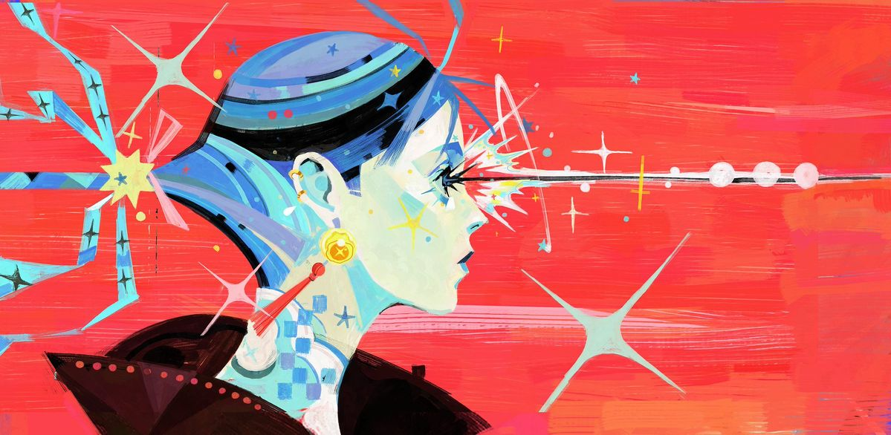

# CART 253 - My Honepage
Bella P.

## What is this?
My homepage for a collection of work experimenting with javascript using p5 library for CART 253. 

## Prototypes Below!!

[Prototype-Instructions-Representational](Prototypes/Instructions/Representational%20Prototype/index.html)
[Prototype-Intructions-Abstract](Prototypes/Instructions/Abstract%20Prototype/index.html)
[Prototype-Varaibles](Prototypes/Variables/index.html)

## Challenges Below!!

[Challenges-Variables ](Challenges/Variables_BellaPerez/index.html) 
[Challenges-Conditionals](Challenges/Conditionals_BellaPerez/index.html)
[Challenges-Events](Challenges/Events_BellaPerez/index.html)

## Journal Below!!

[Journal](Journal.md)

### Where you can find me!
[Itch.io](https://hheavenly.itch.io/)
[GitHub](https://github.com/NanaO707)

## Attribution

This bit should attribute any code, assets or other elements used taken from other sources. For example:

> - This project uses [p5.js](https://p5js.org).
> - The banner image is from @_rexpo on X(twitter) 
> - The barking sound effect is "single dog bark 1" by crazymonke9 from freesound.org: https://freesound.org/people/crazymonke9/sounds/418107/

## License

This bit could include the license you want to apply to your work. For example:

> This project is licensed under a Creative Commons Attribution ([CC BY 4.0](https://creativecommons.org/licenses/by/4.0/deed.en)) license with the exception of libraries and other components with their own licenses.